# Alarms

This module is responsible for generating alarms and sending notifications about them.

Class Alarm has an abstract method `checkAlarm()`, which allows us to implement our own alarms.

Alarms can be aggregated by logic functions or/and.

Examples of alarms can be found in impl package.

## BetweenValuesAlarm

Checks if trend is between minimal and maximal allowed values.

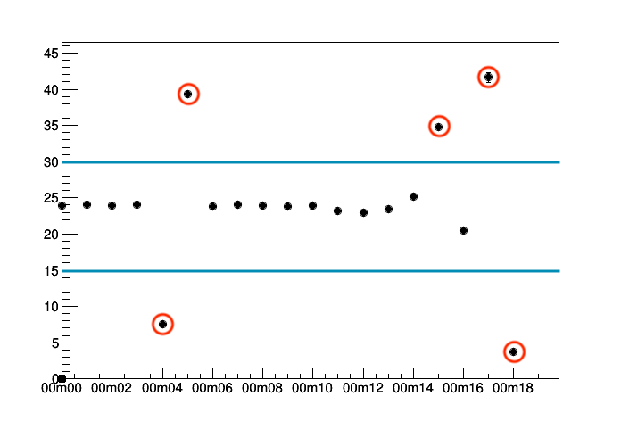

## MeanInRangeAlarm

Checks if mean from N last measurements is in the range.
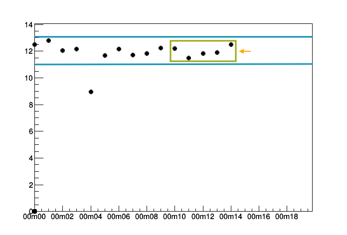
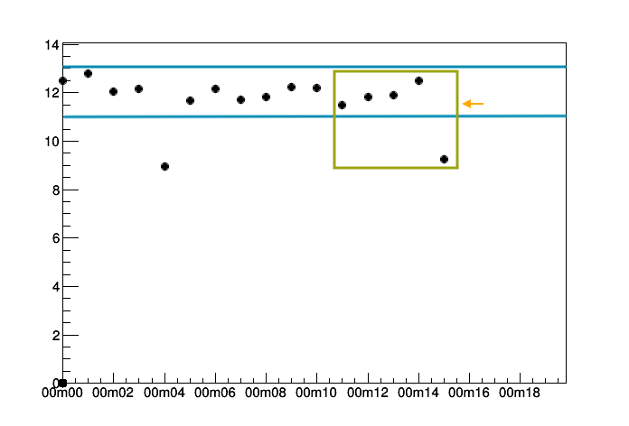
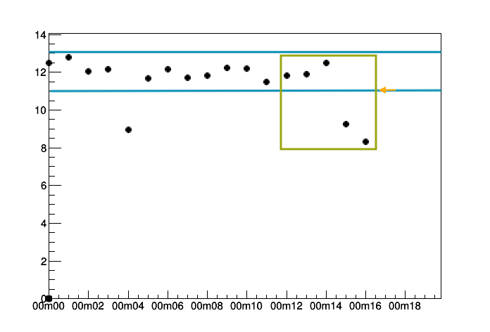
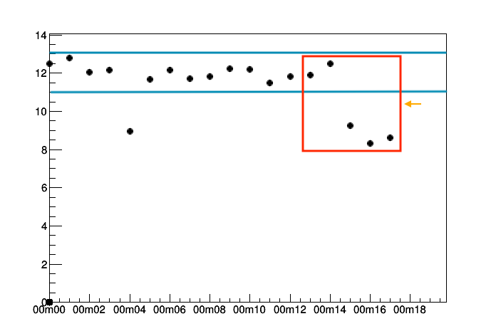

## AbsolutePreviousValueAlarm

Check if (new value - old value) is different more than delta.

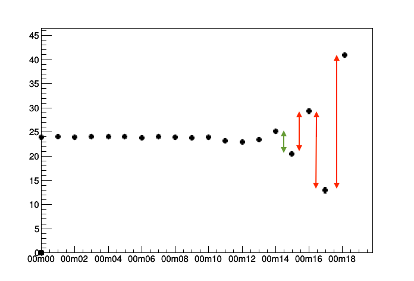

## RelativeProviousValueAlarm

Check if new value is between (previous value)/ratio and (previous value)*ratio.

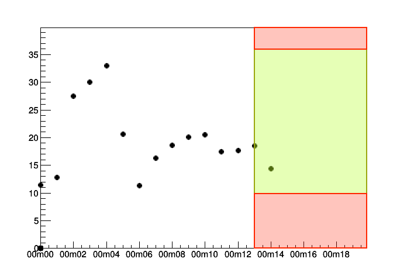
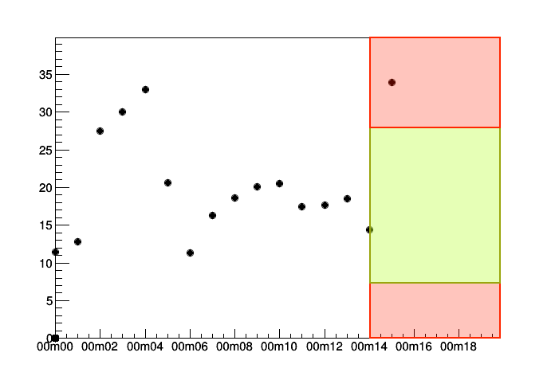
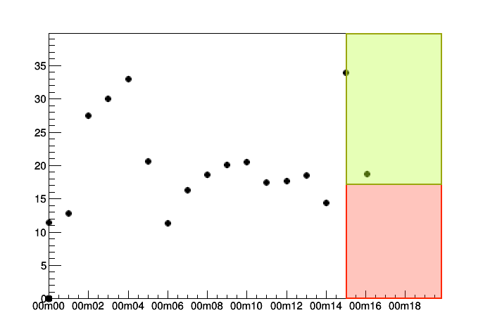
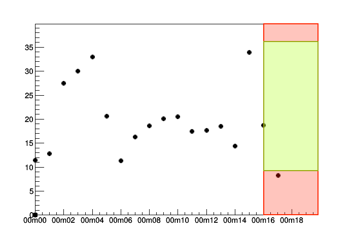


## CheckLastNAlarm

Check if minimum ratio*N last N alarms are in range.

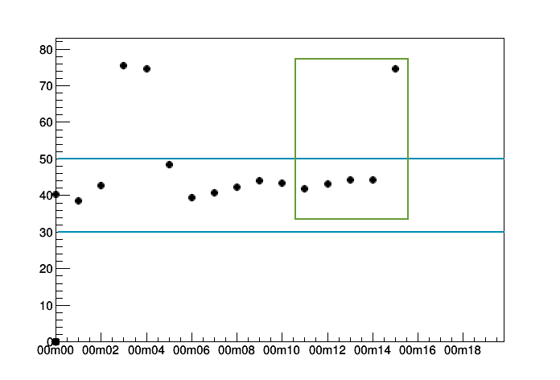
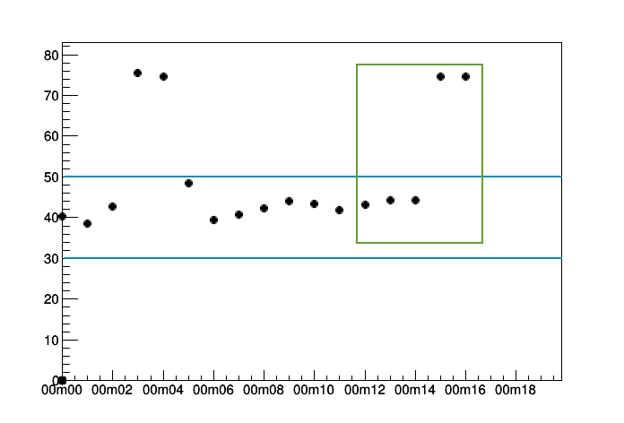
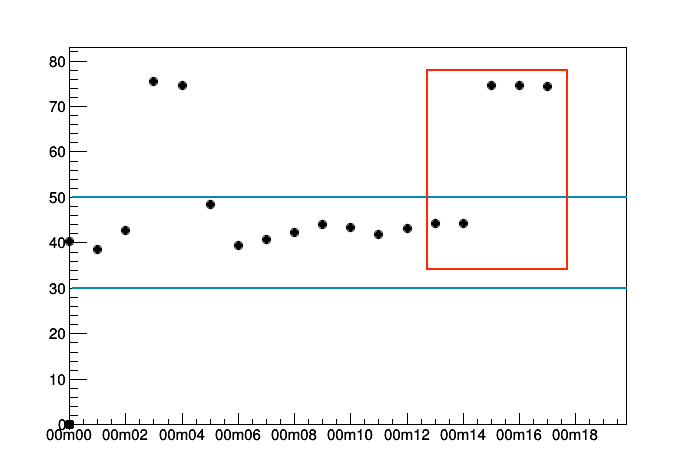
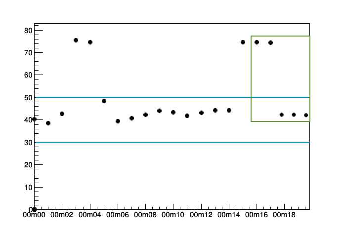


## Displaying on the webApp
When histogram is processed and alarms are generated, they are displayed above this histogram on the webApp.

# Class Diagram


# Notifications

Each generated alarm is collected by AlarmCollector. It allows us send notifications about alarms when we want:
after processing trending object, after processing histogram or when all histograms are processed. To send messages via email
you have to call
`announceOnEmail()` method on alarmCollector object. To print messages on console call `showOnConsole()` method. To
send on Slack call `announceOnSlack()`

## Emails

There is possibility to send notifications about alarms via email. To send emails add to configuration file following information:

```yaml
# Email configuration for gmail
emailDelivery:
    smtpSettings:
      address: "smtp.gmail.com"
      port: 587
      userName: "email@address"
      password: "password"
```

## Slack

To send messages on Slack add to configuration file:

```yaml
# Slack configuration
# Define token and channel
slack:
  apiToken: 'token'
  slackChannel: "alarms"
```

# Usage

To specify alarms and receivers write for example following function:

```python
def alarmConfig():
    recipients = ["test1@mail", "test2@mail"]
    mailSender = MailSender(recipients)
    slackSender = SlackNotification()
    borderWarning = BetweenValuesAlarm(minVal=0, maxVal=50, alarmText="WARNING")

    borderWarning.receivers = [printCollector]

    borderError = BetweenValuesAlarm(minVal=0, maxVal=70, alarmText="ERROR")
    borderError.receivers = [mailSender, slackSender]

    bva = BetweenValuesAlarm(minVal=0, maxVal=90, alarmText='BETWEEN')
    # TODO add second alarm to andAlarm
    seriousAlarm = AndAlarm([bva], "Serious Alarm")
    seriousAlarm.addReceiver(mailSender)

    return [borderWarning, borderError, seriousAlarm]
```

You can define separate alarms to different trending objects:

```python
def alarmMeanConfig():
    slack = SlackNotification()
    lastAlarm = CheckLastNAlarm(alarmText="ERROR")
    lastAlarm.receivers = [printCollector, slack]

    return [lastAlarm]

def alarmStdConfig():
    slack = SlackNotification()
    meanInRangeWarning = MeanInRangeAlarm(alarmText="WARNING")
    meanInRangeWarning.receivers = [printCollector, slack]

    return [meanInRangeWarning]

def alarmMaxConfig():
    recipients = ["test1@mail", "test2@mail"]
    mailSender = MailSender(recipients)
    borderWarning = BetweenValuesAlarm(minVal=0, maxVal=50, alarmText="WARNING")
    borderWarning.receivers = [printCollector, mailSender]

    return [borderWarning]
```

To use alarms, define them in EMC.py or other detector file in `getTrendingObjectInfo()`:

```python
     trendingNameToObject = {
        "max": trendingObjects.MaximumTrending,
        "mean": trendingObjects.MeanTrending,
        "stdDev": trendingObjects.StdDevTrending,
    }
    # Assign created earlier alarms to particular trending objects
    alarms = {
        "max": alarmMaxConfig(),
        "mean": alarmMeanConfig(),
        "stdDev": alarmStdConfig()
    }
    trendingInfo = []
    for prefix, cls in trendingNameToObject.items():
        for dependingFile, desc in infoList:
            infoObject = TrendingInfo(prefix + dependingFile, desc, [dependingFile], cls)
            if prefix in alarms:
                infoObject.addAlarm(alarms[prefix])       # Set alarms
            trendingInfo.append(infoObject)
    return trendingInfo
```