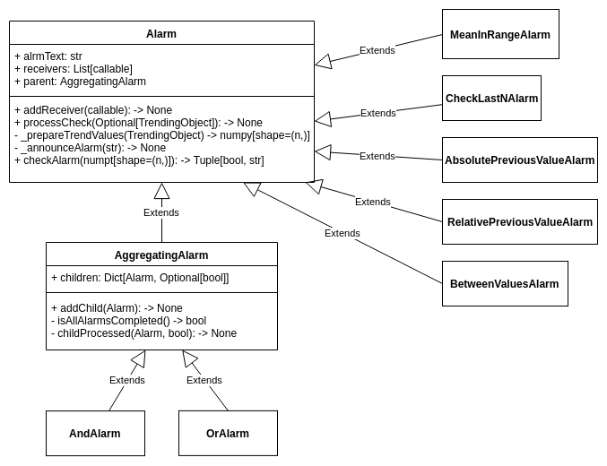

# Alarms

This module is responsible for generating alarms and sending notifications about them.

Class Alarm has an abstract method `checkAlarm()`, which allows us to implement our own alarms.
Examples of alarms can be found in impl package.

Alarms can be aggregated by logic functions or/and.


## Displaying on the webApp
When histogram is processed and alarms are generated, they are displayed above this histogram on the webApp.

# Class Diagram


# Notifications

Each generated alarm is collected by AlarmCollector. It allows us send notifications about alarms when we want:
after processing trending object, after processing histogram or when all histograms are processed. You have to call
`announceAlarm()` method on alarmCollector object. AlarmCollector also groups alarms.

## Emails

There is possibility to send notifications about alarms via email. To send emails add to configuration file following information:

```yaml
# Email configuration for gmail
emailDelivery:
    smtpSettings:
      address: "smtp.gmail.com"
      port: 587
      userName: "email@address"
      password: "password"
    recipients:
      EMC:
        - "emcExpert1@mail"
        - "emcExpert2@mail"
      HLT:
        - "hltExpert1@mail"
        - "hltExpert2@mail"
      TPC:
        - "tpcExpert1@mail"
        - "tpcExpert2@mail"
```

## Slack

To send messages on Slack add to configuration file:

```yaml
# Slack configuration
# Define token and channel
slack:
  apiToken: 'token'
  slackChannel: "alarms"
```

# Usage

To specify alarms and receivers write following function:

```python
def alarmConfig(recipients):

    mailSender = MailSender(recipients)
    slackSender = SlackNotification()
    boarderWarning = BetweenValuesAlarm(minVal=0, maxVal=50, alarmText="WARNING")

    boarderWarning.receivers = [printCollector]

    borderError = BetweenValuesAlarm(minVal=0, maxVal=70, alarmText="ERROR")
    borderError.receivers = [mailSender, slackSender]

    bva = BetweenValuesAlarm(minVal=0, maxVal=90, alarmText='BETWEEN')
    # TODO add second alarm to andAlarm
    seriousAlarm = AndAlarm([bva], "Serious Alarm")
    seriousAlarm.addReceiver(mailSender)

    return [boarderWarning, borderError, seriousAlarm]
```

You can define separate alarms to different trending objects:

```python
def alarmMeanConfig():
    slack = SlackNotification()
    lastAlarm = CheckLastNAlarm(alarmText="ERROR")
    lastAlarm.receivers = [printCollector, slack]

    return [lastAlarm]

def alarmStdConfig():
    slack = SlackNotification()
    meanInRangeWarning = MeanInRangeAlarm(alarmText="WARNING")
    meanInRangeWarning.receivers = [printCollector, slack]

    return [meanInRangeWarning]

def alarmMaxConfig(recipients):
    mailSender = MailSender(recipients)
    borderWarning = BetweenValuesAlarm(minVal=0, maxVal=50, alarmText="WARNING")
    borderWarning.receivers = [printCollector, mailSender]

    return [borderWarning]
```

To use alarms, define them in EMC.py or other detector file in `getTrendingObjectInfo()` function:

```python
    if "emailDelivery" in processingParameters:
        recipients = processingParameters["emailDelivery"]["recipients"]["EMC"]
    else:
        recipients = None
    alarms = {
        "max": alarmMaxConfig(recipients),
        "mean": alarmMeanConfig(),
        # "stdDev": alarmStdConfig()
    }
    trendingInfo = []
    for prefix, cls in trendingNameToObject.items():
        for dependingFile, desc in infoList:
            infoObject = TrendingInfo(prefix + dependingFile, desc, [dependingFile], cls)
            if prefix in alarms:
                infoObject.addAlarm(alarms[prefix])
            trendingInfo.append(infoObject)
    return trendingInfo
```