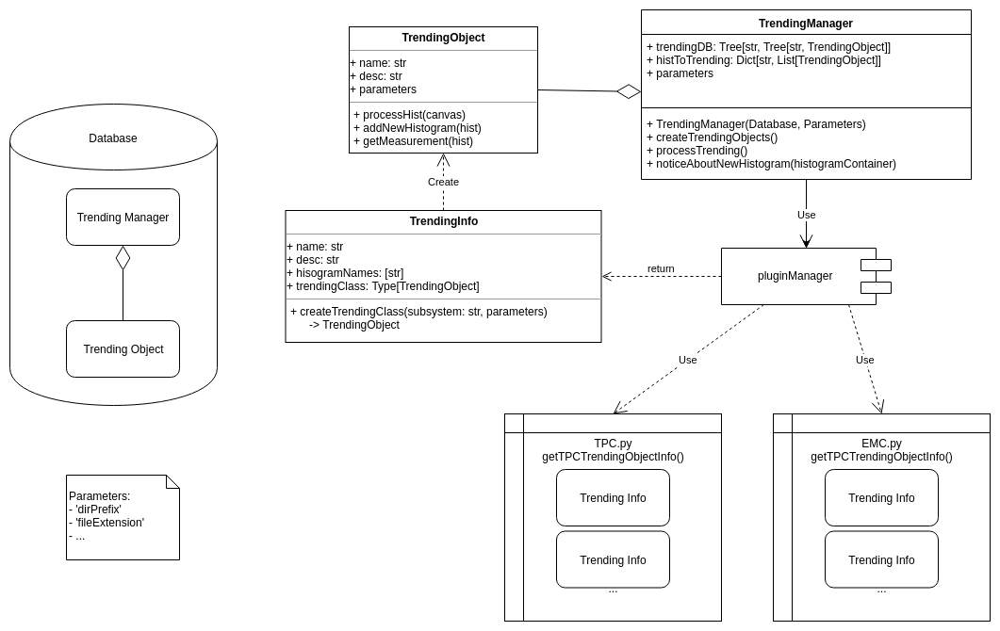
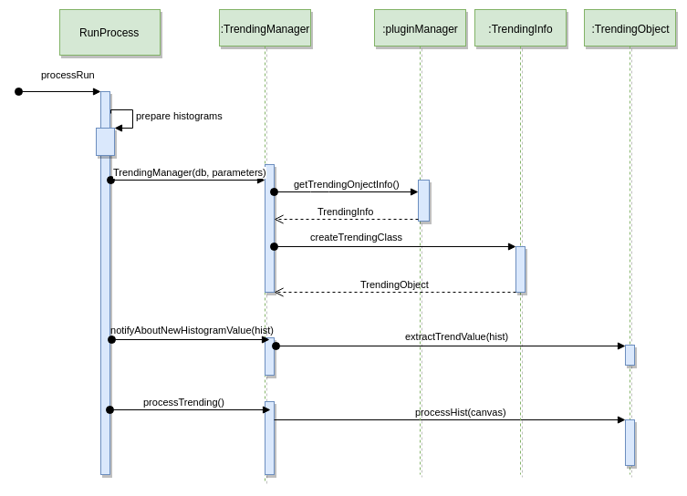

# Trending Manager

TrendingManager is responsible for keep all Trending Object in one place.
In constructor manager takes database and all parameter.

Before processing function 'createTrendingObjects' must be called.
It import module 'qa' and for all subsystem try get information
about trending object information (by invoke 'getSYSTrendingObjectInfo' function from SYS.py).
Then create TrendingObject indicated in info.

After root hist is available, manger is noticed about new histogram.
It invoke all TrendingObjects that wanted this specific histogram.

# Trending Info
TrendingInfo are simple object containing:
- name of trending
- description
- histogram that are using while trend processing
- TrendingObject class responsible for computing trends

# Trending Object
TrendingObject is abstract class responsible for adding measurements.

It contains methods to implement by subclass:
- initStartValue() -> \[T] ---> Return container stored trended values
- getMeasurement(hist: histogramContainer) -> T ---> Compute trend value from histogramContainer
- retrieveHist() -> TObject ---> Create root object from trended values

# General Diagram

# Sequence Diagram

